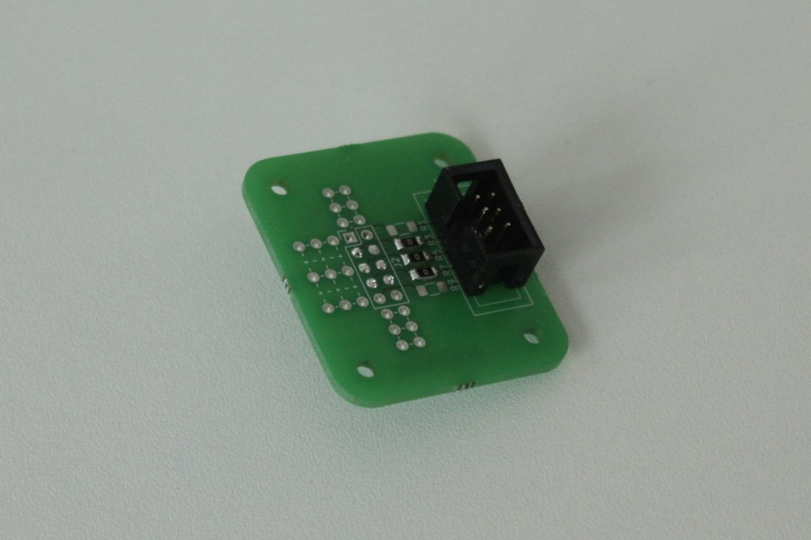
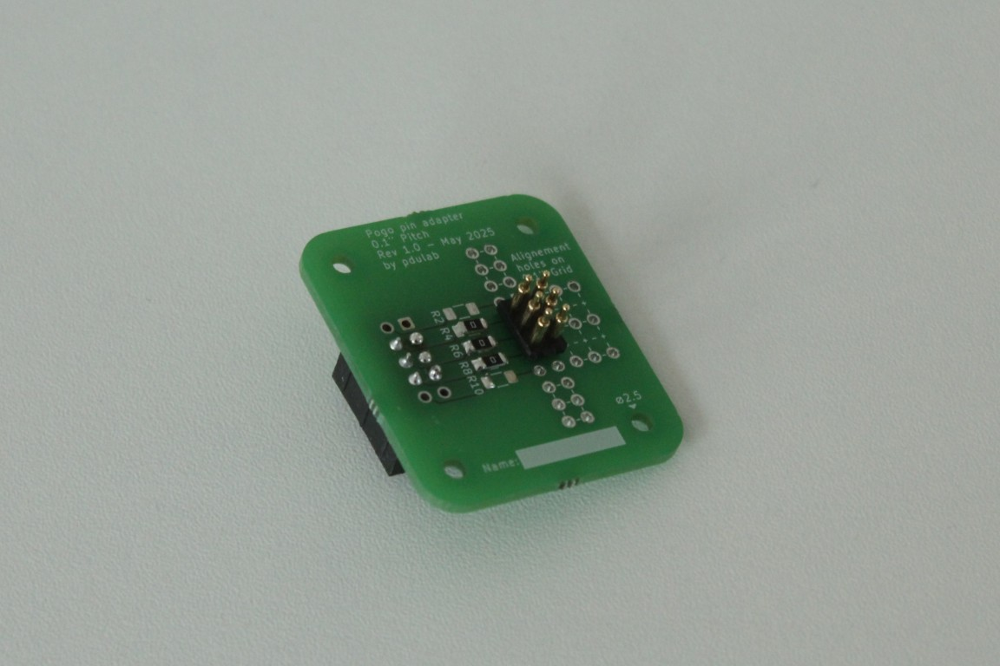
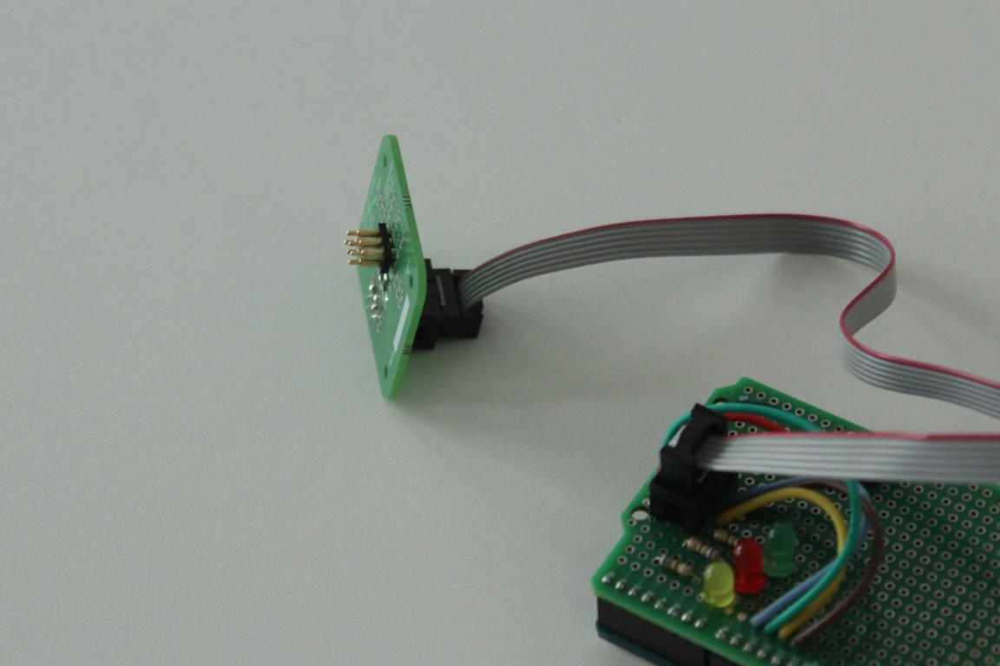

# Pogo pin 2.54mm programmer

A simple board with pogo pins. It can be used to program or interface with any board that has exposed pads on a 0.1"/2.54mm pitch grid (maximum grid size of 02x05).
I originally designed it to program another project that has exposed programming pads.

## Features
- Accommodates up to 2x5 pogo pins.
- Extra holes on a 2.54mm (0.1") grid on which alignment pins can be soldered. This makes it easier to align the pogo pins on the pads (if the pads are $n\times2,54mm$ from the side of the PCB).
- Short-circuit protection resistors on each pin. If short circuit protection is not needed, simply solder $0\Omega$ resistors. Resistor size is `1206`.

## Mechanical
- Board size is 35mm x 40mm.
- Mounting holes are 2.5mm in diameter and spaced 25mm x 30mm apart.

## Pictures
Here are some pictures of the board after soldering: 

And an example of how you can use as a programmer (extra programmer hardware not included in this repo):

## License

Copyright pdulab 2025

This project is licensed under [CERN-OHL-W v2](https://cern-ohl.web.cern.ch/).

You may redistribute and modify this documentation and make products using it under the terms of the CERN-OHL-W v2 (https://cern-ohl.web.cern.ch/).
This documentation is distributed WITHOUT ANY EXPRESS OR IMPLIED WARRANTY, INCLUDING OF MERCHANTABILITY, SATISFACTORY QUALITY AND FITNESS FOR A PARTICULAR PURPOSE. Please see the CERN-OHL-W v2 for applicable conditions.

